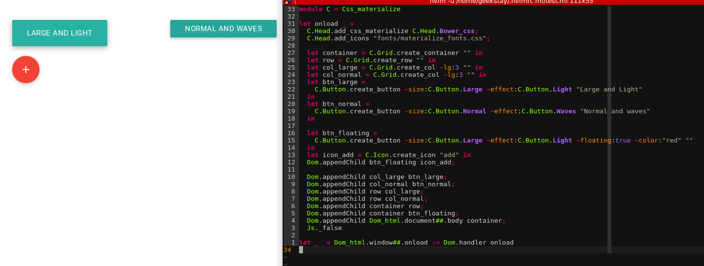

# ocaml-materializecss



Create HTML elements in OCaml using Material Design with [MaterializeCSS](http://materializecss.com/).

## How to install?

ocaml-materializecss depends on
[jsoo_lib](https://github.com/dannywillems/jsoo-lib), a set of functions to use
js_of_ocaml easier. You need to pin the opam repository:

```
opam pin add jsoo_lib https://github.com/dannywillems/jsoo-lib.git
```

```
opam pin add ocaml-materializecss https://github.com/dannywillems/ocaml-materializecss.git
```

## How to use it?

All functions is in ```Css_materiliaze``` module. This main module contains
submodules depending on the purpose of their content. For example, the
submodule ```Css_materialize.Head``` contains functions to add automatically the
css and javascript files. If you use [bower](http://bower.io/), you can use
```
Css_materiliaze.Head.add_css_link Css_materialize.Head.Bower_css
```
to add the css in the head tag. Else, you can pass the entire path to the files.

### Head

### Icon

### Grid

### Button
